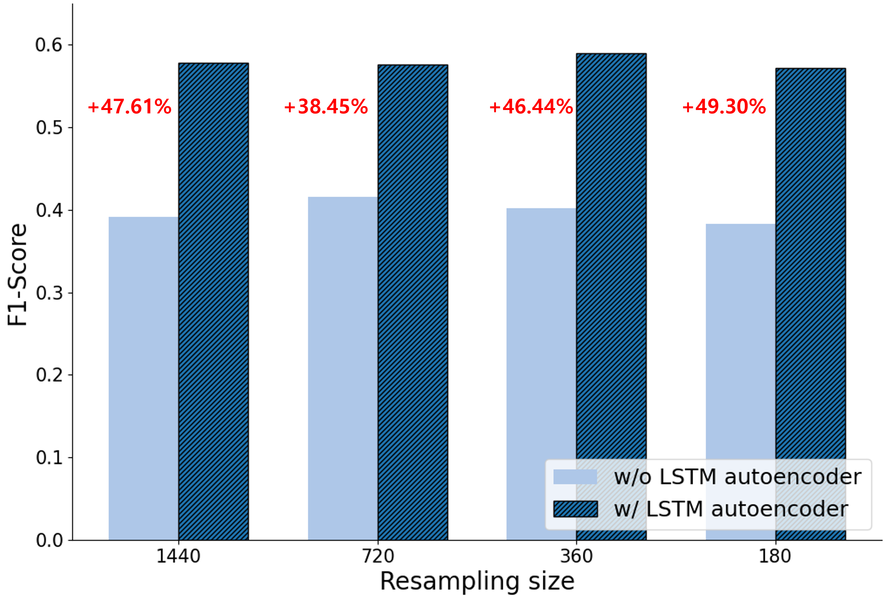
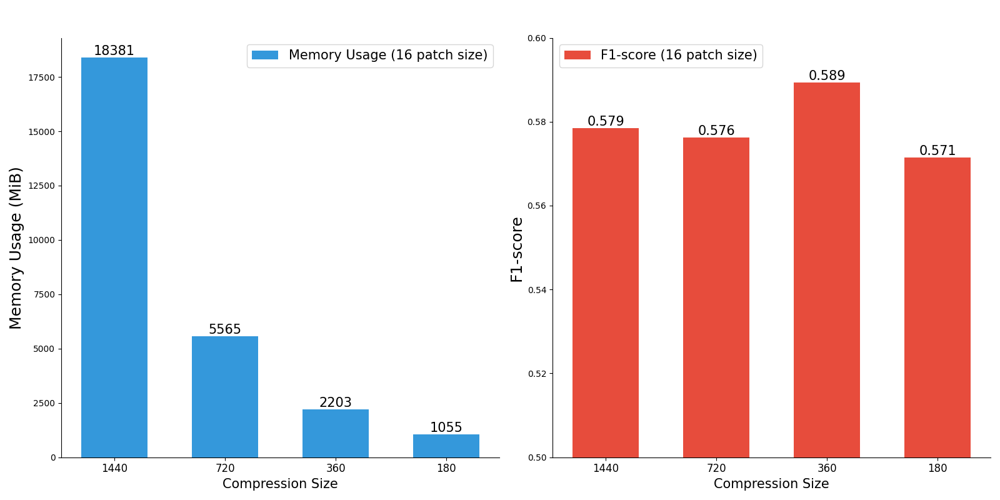
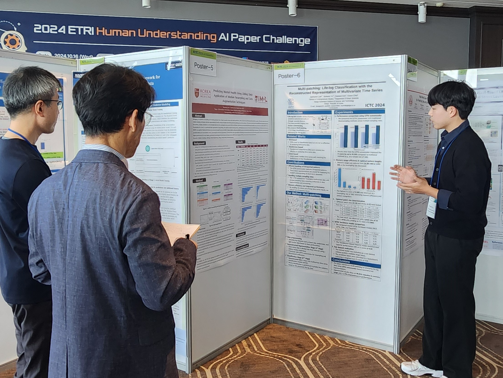
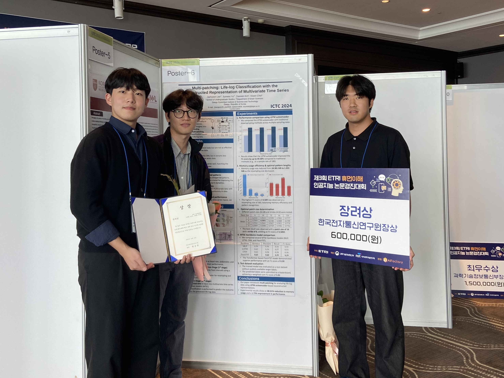

## Introduction
2024년 5월 초, ETRI에서 주관하는 제 3회 ETRI 휴먼이해 인공지능 논문경진대회를 알게 되었다. 
친한 동기들과 대회 참여를 결심했고, 팀장의 역할을 맡게 되었다.

대회는 라이프로그 데이터를 이용한 수면, 감정, 스트레스 인식 및 추론 모델을 제작하는 대회이다.

즉, 특정 user가 하루종일 휴대한 smart phone, smart watch에서 수집한 data를 바탕으로  
해당 날짜의 스트레스 정도, 감정, 수면에 대한 품질, 시간, 효율 등을 예측해야 한다.

수집된 dataset은 device의 acceleration, GPS, light intensity, heart rate 등 다양한 feature를 가진다.

{: .w-70}

## Related Works
### Model
dataset이 user 하루에 대한 multi-modal data이다.

이 data를 잘 분석하여 classification 할 수 있는 모델이 필요하였고, 이에 대한 background 형성을 진행하였다.

time-series data를 잘 분석할 수 있는 모델은 크게 3가지로 나뉘었다.

1. Transformer-based Model 
  해당 모델은 흔히 좋은 성능을 가졌다고 알려진 transformer를 사용하는 모델이다. 
  LLM이나 Vision에서 많이 사용되지만, 최근 time-series data에도 적용된 모델이 나왔다.

2. Linear-based Model 
  Linear 기반 모델은 transformer 기반 모델을 비판하기 위해 나온 모델이다. 
  transformer 기반 모델은 complexity가 높아서 좋은 성능이 나오지만,  
  complexity에 비해 time series information을 잘 분석하지 못하기 때문에 linear 기반 모델로 time-series information을 잘 분석하면 더 좋은 성능이 나온다는 내용 위주이다.

3. TCN-based Model 
  time-series data를 이미지 형식으로 변환해서 CNN 모델을 적용하는 방식이다. 
  이러한 방식은 기존 CNN의 이미지 분석 performance가 뛰어나기에 준수한 성능을 가진다.

### Data
위 내용을 기반으로 Transformer 기반 모델의 성능이 모델의 complexity에서 기원하였다는 사실과, 
linear-based model로부터 time-series information analyzing의 중요성을 깨달았다.

time-series information을 잘 분석하기 위해서는 모델에게 2가지 요소를 잘 이해시켜야 한다.

1. Intra-Period Pattern 
  time-series data의 특정한 짧은 구간 내의 정보를 의미한다.

2. Inter-Period Pattern 
  Intra-Period를 분석하는 특정 구간들 사이의 유의미한 정보를 의미한다.

이 두 가지 information을 잘 분석하면 time-series data에서 더 의미 있는 정보를 가져올 수 있다.

## Challenge
위에서 background를 쌓으며, time-series data를 분석에 유리한 요소를 알 수 있었다.

하지만 이 대회에서 download한 dataset에는 몇 가지 challenging한 요소가 있었다. 
1. Large-Size Dataset 
  dataset의 size가 200GB에 달했으며, 이 size는 user 수가 많아서가 아닌, 
  user마다 여러 feature를 높은 sampling rate로 하루 전체에 대해 수집하여 발생하였다. 
  (User LifeLog에 대한 Raw Data)

2. Different Sampling Rate for each Features (Multi-Modal) 
  각 feature들은 모두 다른 sampling rate을 갖고 있었다. 
  예를 들어, light intensity는 10분에 한번씩 측정되고, acceleration과 같은 feature는 30Hz로 측정되었다.

3. Lots of NaN value 
  사용자가 device를 착용하거나 휴대하지 않을 경우, data가 NaN으로 적용되어, 생각보다 많은 구간의 data가 손실되어 있었다.
  
Challenge part에서 NaN value가 많은 문제는 interpolation의 방식으로 대응할 수 있었다.

하지만 feature마다 다른 sampling rate을 갖고, user당 data size가 너무 큰 문제는 쉽게 해결할 수 없었다.

1. feature마다 sampling rate이 작아지도록 resampling을 진행하면, data가 갖는 정보가 크게 손실되었고,
2. data가 큰 sampling rate을 갖도록 resampling하면, user당 data size가 커서 모델 학습 시, memory issue가 발생하였다.

이 문제들을 해결하기 위한 새로운 방식이 필요하였다.

## Method
위 문제를 한 번에 해결하며 time-series information을 더 잘 분석하기 위하여 LSTM-AutoEncoder와 Patch-TST를 사용하였다.

새로운 AI model이 아닌 기존에 존재하던 model을 활용하여 2-stage AI process 방법론을 제작하게 되었다.

1. 먼저 time-series data가 feature마다 다른 sampling rate을 갖기 때문에, 이 data를 특정 개수의 구간을 나뉠 수 있도록 각 patch로 나눈다. 
  (각 feature마다 patch의 개수는 갖지만 patch 안에 담긴 data 수는 다를 것이다.)
2. 이 각 patch를 lstm-autoencoder로 압축을 진행한다. 
  (이 과정에서 각 patch내의 intra-period pattern이 내포된 latent vector로 압축이 되며, 각 feature가 같은 size를 갖도록 resampling되는 효과를 얻을 수 있다.)
3. 압축된 각 patch를 이어서, Patch-TST를 통해 classification을 진행한다. 
  (이 과정을 통해서 Patch-TST가 patch들 간의 inter-period를 잘 분석하여 classification을 진행하게 된다.)

{: .w-70}

이와 같은 process를 통해서 train, inference가 진행되며, 1-stage에서 압축의 과정이 있어 프로세스 속도의 향상과 memory issue를 한꺼번에 해결 가능하다.

dataset에서 patch로 나뉜 data가 LSTM-AutoEncoder에 들어가고, LSTM-AutoEncoder의 output이 Patch-TST에서 다시 Patch화되어 적용되어  
논문의 이름을 [multi-patching: life-log classification with the reconstructed representation of multivariate time series]으로 짓게 되었다!

## Result
위의 Method를 사용한 결과, 아래와 같이 단순 resampling 하였을 때보다 memory 사용량을 획기적으로 줄이면서도 더 높은 성능을 자랑할 수 있었다.

    
    

<!-- 
 -->

## Review of Contest
결론적으로 이 대회에서는 장려상을 차지하게 되었다!

    
    

<!-- 
 -->

대회에 대한 몇 가지 회고를 적어본다. 
먼저 수상팀 중, 우리 팀을 제외한 팀들은 모두 대학원생이였다. 
학부생으로써 한 자리를 차지할 수 있었음에 다행이라 생각한다.

또한 포스터 발표 과정에서 ETRI 담당자님이 performance를 판단하는 대회에서 왜 논문 Novelty에 신경 썼는지를 여쭤보셨다. 
(사실 논문 내용에 대한 정성적인 평가도 들어가는줄 알았지만 그게 아니였다ㅠㅠ)

performance에 더 집중하였다면, 더 높은 성적을 가질 수 있었겠지만,  
새로운 process를 만드는 과정과 논리적 novelty를 논문으로 작성할 수 있었기에 후회는 없다!